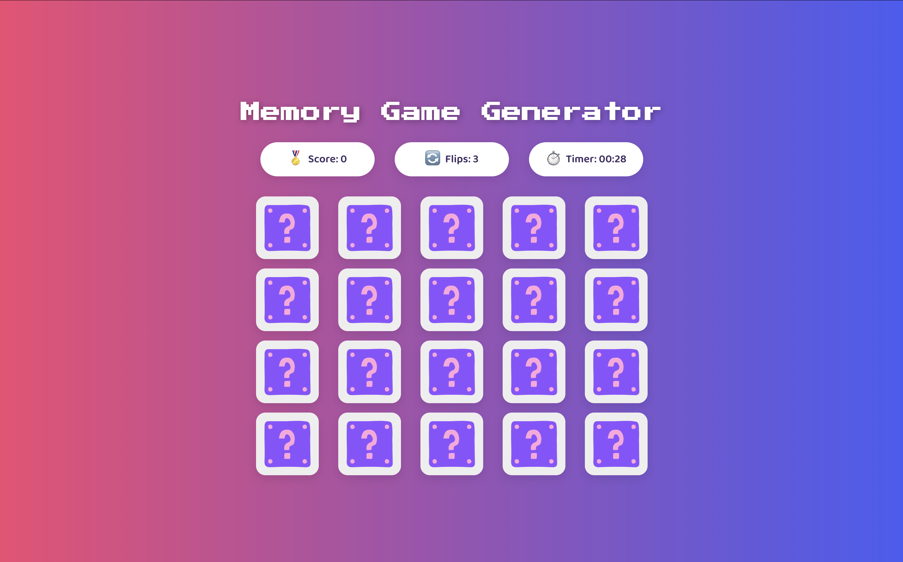

# Memory Game Generator

A fun and interactive memory card game built with React, where you can generate custom card decks using images from Unsplash API.

## Screenshots
 



## Features
- Custom Image Decks: Type a topic and generate cards based on Unsplash images.
- Flip & Match: Flip cards to find matching pairs.
- Stats Tracking: Tracks number of flips, matched cards, and elapsed time.
- Best Time: Saves your best completion time in local storage.
- Confetti Celebration: Celebrate when you complete the game.

## Technologies
- React – Frontend framework
- Unsplash API – Dynamic image fetching
- Canvas-Confetti – Confetti effect on win
- CSS3 & Flex/Grid – Responsive layout

## Installation
Clone the repository:

```
git clone https://github.com/your-username/memory-game.git
cd memory-game
```

Install dependencies:

```
npm install
```

Create a .env file in the project root and add your Unsplash API key:

```
REACT_APP_UNSPLASH_ACCESS_KEY=your_unsplash_key_here
```

How do get your key: https://unsplash.com/developers

Make sure the .env file is listed in .gitignore so your key stays private.

Start the development server:

```
npm start
```

## How to Play
- Type a topic in the input box (e.g., “cats”, “nature”).
- Click Generate Game to load a custom deck.
- Flip cards to find matching pairs.
- Track your flips and time in the stats bar.
- When all pairs are matched, a confetti animation will play and your score will be displayed.
- Click Play Again to start a new game.


## Notes
- Unsplash API key is required for fetching images.
- Best time is stored locally using browser localStorage.
